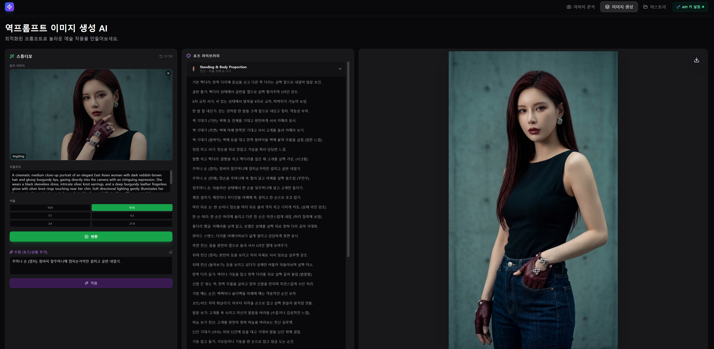

# 역프롬프트 이미지 생성 AI

[한국어](README.md) | [English](README_EN.md)

> 참조 이미지를 전문가급 영문 프롬프트로 역분석하고, 프롬프트 개선부터 이미지 생성·변환·후속 편집까지 한 화면에서 처리하는 Gemini·OpenAI 기반 AI 이미지 스튜디오입니다.

[-7C3AED?style=for-the-badge&logo=github&logoColor=white)](https://github.com/cybereun)
[](https://github.com/cybereun/reverse-prompt-AI)


[](LICENSE)

<p align="center">
  
</p>

<p align="center">
  <sub>이미지 생성 스튜디오 — 참조 이미지, 프롬프트, 포즈 라이브러리와 생성 결과를 한 화면에서 관리합니다.</sub>
</p>

## 목차

- [앱 소개](#앱-소개)
- [결과 예시](#결과-예시)
- [주요 특징](#주요-특징)
- [기능 상세](#기능-상세)
- [사용 방법](#사용-방법)
- [설치 및 실행](#설치-및-실행)
- [API 키 설정](#api-키-설정)
- [프로젝트 구조](#프로젝트-구조)
- [기술 구성과 동작 방식](#기술-구성과-동작-방식)
- [서버 API](#서버-api)
- [빌드 및 배포](#빌드-및-배포)
- [문제 해결](#문제-해결)
- [현재 동작 범위와 주의사항](#현재-동작-범위와-주의사항)
- [라이선스](#라이선스)
- [개발자](#개발자)

## 앱 소개

**역프롬프트 이미지 생성 AI**는 이미지의 피사체, 조명, 카메라, 구도, 색감과 분위기를 Google Gemini로 분석하여 재사용 가능한 영문 이미지 생성 프롬프트를 만들어 줍니다.

분석 결과를 복사하는 데서 끝나지 않고 다음 작업까지 하나의 흐름으로 연결합니다.

```text
참조 이미지 업로드
  → 이미지 전체/기술 분석
  → 영문 프롬프트 추출 및 업그레이드
  → Text-to-Image 또는 Image-to-Image 생성
  → 포즈·상황을 추가한 후속 편집
  → 이미지 다운로드 및 세션 히스토리 재사용
```

한국어로 아이디어를 입력해도 프롬프트 업그레이드 기능이 이미지 생성에 적합한 전문 영문 프롬프트로 다듬어 줍니다.

## 결과 예시

아래는 원본 이미지를 참조 이미지로 입력하고, 이 앱의 Image-to-Image 및 후속 편집 기능을 이용해 포즈와 상황, 배경을 변경한 실제 작업 예시입니다.

### 원본 이미지

<p align="center">
  
</p>

<p align="center">
  <sub>원본 — 지하철 내부에 서 있는 인물 이미지</sub>
</p>

### 앱을 통한 수정 결과

<table>
  <tr>
    <td align="center" width="50%">
      
    </td>
    <td align="center" width="50%">
      
    </td>
  </tr>
  <tr>
    <td align="center"><strong>수정 결과 1</strong><br>지하철이라는 공간 특성을 유지하면서 자세와 상황을 변경한 결과</td>
    <td align="center"><strong>수정 결과 2</strong><br>인물의 스타일을 이어가면서 포즈와 배경을 계단 장면으로 변경한 결과</td>
  </tr>
</table>

> 생성 및 수정 결과는 프롬프트, 참조 이미지, Gemini 모델 버전과 실행 시점에 따라 달라질 수 있습니다.

## 주요 특징

| 특징 | 설명 |
| --- | --- |
| 이미지 역프롬프트 | 참조 이미지를 분석해 이미지 생성에 사용할 수 있는 상세 영문 프롬프트를 추출합니다. |
| 2가지 분석 모드 | 장면 전체를 재현하는 **전체 분석**과 촬영 스타일만 추출하는 **기술 분석**을 제공합니다. |
| 프롬프트 업그레이드 | 짧거나 한국어로 작성된 내용을 촬영 장비, 조명, 색보정 용어가 포함된 전문 영문 프롬프트로 개선합니다. |
| Text-to-Image | 텍스트 프롬프트만으로 새로운 이미지를 생성합니다. |
| Image-to-Image | 참조 이미지와 프롬프트를 함께 사용하여 스타일·조명·구도를 반영한 이미지를 생성합니다. |
| 생성 이미지 재편집 | 생성 결과에 포즈나 상황을 추가하고 같은 작업 화면에서 다시 편집할 수 있습니다. |
| 포즈 라이브러리 | 카테고리별 포즈 문장을 클릭해 수정 프롬프트에 빠르게 추가할 수 있습니다. |
| 다양한 화면 비율 | `16:9`, `9:16`, `1:1`, `4:3`, `3:4`, `21:9`를 지원합니다. |
| 작업 히스토리 | 현재 브라우저 세션의 분석·생성 결과를 갤러리로 모아 보고 프롬프트를 재사용할 수 있습니다. |
| 이미지 다운로드 | 생성 결과와 히스토리 이미지를 PNG 파일로 저장할 수 있습니다. |
| 멀티 AI 제공자 | API 키 설정창에서 Google Gemini와 OpenAI를 전환해 같은 작업 흐름으로 사용할 수 있습니다. |
| 제공자별 로컬 API 키 | Gemini와 OpenAI 키를 서로 분리해 사용자의 브라우저 로컬 저장소에 보관하고 개별 삭제할 수 있습니다. |
| 반응형 다크 UI | 데스크톱과 모바일 화면에 대응하는 스튜디오형 다크 인터페이스를 제공합니다. |
| PWA 메타데이터 | 웹 앱 매니페스트와 앱 아이콘을 포함해 독립 실행형 웹 앱 구성을 지원합니다. |

## 기능 상세

### 1. 이미지 분석

이미지를 클릭해서 선택하거나 드래그 앤 드롭으로 업로드할 수 있습니다. JPG, PNG, WebP를 포함해 브라우저가 인식하는 이미지 형식을 입력으로 받습니다.

- **전체 분석**
  - 피사체의 외형, 포즈, 의상
  - 광원의 품질, 방향, 색상
  - 렌즈, 초점거리, 심도
  - 분위기와 감정
  - 컬러 그레이딩과 팔레트
  - 원본 장면을 재현하기 위한 하나의 영문 프롬프트 생성

- **기술 분석**
  - 특정 인물이나 사물의 설명은 제외
  - 조명 방식과 광원 방향
  - 색온도와 색상 팔레트
  - 렌즈 특성, 조리개, 보케
  - 카메라 앵글과 구도
  - 필름 또는 디지털 센서 질감
  - 어떤 피사체에도 적용할 수 있는 스타일 프롬프트 생성

이미지와 함께 추가 요청을 입력하면 해당 내용을 분석 지침에 반영합니다. 이미지 없이 텍스트만 입력한 경우에는 그 텍스트를 결과 프롬프트로 바로 전달할 수 있습니다.

### 2. 프롬프트 업그레이드

분석 결과 또는 직접 입력한 프롬프트를 다음 요소가 포함된 전문 영문 프롬프트로 확장합니다.

- ARRI, Sony Venice 등의 카메라 특성
- Kodak Portra 등의 필름 룩
- 볼류메트릭 포그, 키아로스쿠로 같은 조명 표현
- 틸 앤 오렌지, 블리치 바이패스 같은 색보정 용어
- 고급 이미지 생성 모델에 적합한 구체적이고 시각적인 묘사

결과 프롬프트는 복사하거나 **이미지 생성으로 이동** 기능으로 생성 탭에 바로 전달할 수 있습니다.

### 3. 이미지 생성

- 프롬프트만 입력하면 **Text-to-Image** 방식으로 이미지를 생성합니다.
- 참조 이미지도 업로드하면 **Image-to-Image** 방식으로 변환합니다.
- 생성 전에 원하는 화면 비율을 선택할 수 있습니다.
- 생성된 이미지는 미리보기 화면에서 확인하고 즉시 다운로드할 수 있습니다.

### 4. 이미지 후속 편집

생성된 이미지에 수정 내용을 추가한 뒤 다시 Gemini 이미지 모델로 전달할 수 있습니다.

- 인물 포즈 변경
- 상황 또는 동작 추가
- 배경·조명·분위기 변경
- 포즈 라이브러리 항목을 클릭해 수정 문장 추가
- 여러 포즈·지시문을 조합한 반복 편집

### 5. 히스토리

이미지 분석 및 생성 결과는 실행 중인 앱의 메모리에 자동으로 추가됩니다.

- 결과 이미지와 프롬프트 확인
- 분석 종류 및 생성 결과 구분
- 이미지 저장
- 프롬프트 복사
- 선택한 프롬프트를 생성 탭으로 전달하여 재사용

> 현재 히스토리는 서버나 브라우저 저장소에 영구 저장되지 않습니다. 페이지를 새로고침하거나 앱을 종료하면 초기화됩니다.

## 사용 방법

### 처음 시작할 때

1. 앱을 실행하고 브라우저에서 `http://localhost:3000`에 접속합니다.
2. 상단의 **API 키 설정**을 누릅니다.
3. 설정창에서 **Gemini** 또는 **OpenAI** 탭을 선택합니다.
4. Google AI Studio 또는 OpenAI Platform에서 발급받은 키를 입력하고 저장합니다.
5. 상단 표시등이 초록색으로 바뀌면 사용할 준비가 된 것입니다.

서버에 `GEMINI_API_KEY`가 이미 설정되어 있다면 사용자가 브라우저에 별도 키를 등록하지 않아도 됩니다.

### 이미지에서 프롬프트 추출하기

1. **이미지 분석** 탭을 엽니다.
2. 분석할 이미지를 업로드합니다.
3. **전체 분석** 또는 **기술 분석**을 선택합니다.
4. 필요하면 추가 요청을 입력합니다.
5. **이미지 분석 시작**을 누릅니다.
6. 결과 프롬프트를 복사하거나 **프롬프트 업그레이드**를 실행합니다.
7. **이미지 생성으로 이동**을 눌러 결과를 생성 탭으로 전달합니다.

### 새 이미지 만들기

1. **이미지 생성** 탭을 엽니다.
2. 프롬프트를 입력합니다.
3. 참조 이미지를 사용할 경우 왼쪽의 **참조 이미지** 영역에 업로드합니다.
4. 원하는 화면 비율을 선택합니다.
5. 참조 이미지가 없으면 **생성**, 있으면 **변환**을 누릅니다.
6. 생성이 끝나면 미리보기 오른쪽 위의 다운로드 버튼으로 저장합니다.

### 생성된 이미지 수정하기

1. 먼저 이미지를 생성합니다.
2. **수정(포즈/상황 추가)** 입력란에 변경할 내용을 작성합니다.
3. 필요하면 포즈 라이브러리 카테고리를 열고 항목을 클릭합니다.
4. **적용**을 눌러 현재 이미지를 기반으로 새 결과를 만듭니다.
5. 만족할 때까지 지시문을 바꾸어 반복할 수 있습니다.

### 이전 프롬프트 재사용하기

1. **히스토리** 탭을 엽니다.
2. 원하는 카드의 **사용**을 누릅니다.
3. 프롬프트가 클립보드에 복사되고 이미지 생성 탭으로 이동합니다.

## 설치 및 실행

### 요구 사항

- [Node.js](https://nodejs.org/) 20 이상 권장
- npm 10 이상 권장
- Google Gemini API 키
- 최신 Chrome, Edge, Firefox 또는 Safari

### 1. 저장소 복제

```bash
git clone https://github.com/cybereun/reverse-prompt-AI.git
cd reverse-prompt-AI
```

### 2. 의존성 설치

```bash
npm install
```

저장소에는 `bun.lock`도 포함되어 있으므로 Bun을 사용하는 환경에서는 다음 명령도 사용할 수 있습니다.

```bash
bun install
```

한 프로젝트에서는 잠금 파일 충돌을 피하기 위해 npm 또는 Bun 중 하나를 정해 일관되게 사용하는 것을 권장합니다.

### 3. API 키 설정

프로젝트 루트의 `.env.example`을 참고해 `.env` 파일을 만듭니다.

```env
GEMINI_API_KEY=your_gemini_api_key_here
```

또는 서버 키를 두지 않고 앱 실행 후 상단의 **API 키 설정**에서 사용자 키를 등록할 수 있습니다.

### 4. 개발 서버 실행

```bash
npm run dev
```

브라우저에서 다음 주소를 엽니다.

```text
http://localhost:3000
```

개발 모드에서는 Express 서버가 API를 제공하고 Vite가 미들웨어 모드로 프런트엔드를 서비스합니다.

### 5. 프로덕션 빌드 및 실행

```bash
npm run build
npm start
```

빌드 결과는 `dist/`에 생성되며, Express 서버가 정적 파일과 API를 함께 제공합니다.

### 사용 가능한 명령

| 명령 | 설명 |
| --- | --- |
| `npm run dev` | Express와 Vite 개발 서버를 `3000` 포트에서 실행합니다. |
| `npm run build` | Vite 프런트엔드와 Express 서버 번들을 생성합니다. |
| `npm start` | 빌드된 `dist/server.cjs`를 프로덕션 모드로 실행합니다. |

## API 키 설정

Gemini와 OpenAI 키는 설정 모달에서 각각 등록하고 삭제할 수 있습니다.

### 브라우저 로컬 저장소

키는 현재 브라우저의 `localStorage`에 제공자별로 분리 보관됩니다.

| 제공자 | 로컬 저장소 이름 | 프록시 요청 헤더 |
| --- | --- | --- |
| Gemini | `user_gemini_api_key` | `x-gemini-api-key` |
| OpenAI | `user_openai_api_key` | `x-openai-api-key` |

API 요청 시 선택한 제공자의 키만 같은 출처의 Express 프록시에 전달됩니다. OpenAI 키는 서버 환경 변수, 파일 또는 데이터베이스에 저장하지 않으며 현재 요청 처리에만 사용됩니다. Gemini는 기존 호환성을 위해 서버의 `GEMINI_API_KEY` 또는 `API_KEY` 폴백도 지원합니다.

이 방식은 키를 소스 코드나 Git 저장소에 직접 넣지 않는다는 장점이 있지만, 브라우저에서 실행되는 JavaScript와 개발자 도구에서는 접근할 수 있습니다. 공용 PC나 신뢰할 수 없는 브라우저 확장 프로그램이 설치된 환경에서는 사용하지 마세요.

### 키 발급

- Gemini: [Google AI Studio API Keys](https://aistudio.google.com/app/apikey)
- OpenAI: [OpenAI Platform API Keys](https://platform.openai.com/api-keys)

ChatGPT 구독과 OpenAI API 사용량·결제는 별개입니다. 모델 사용 가능 여부, 요금 및 할당량은 각 제공자의 계정과 프로젝트 정책에 따라 달라질 수 있습니다.

## 프로젝트 구조

```text
reverse-prompt-AI/
├─ components/
│  ├─ Analyzer.tsx         # 이미지 분석과 프롬프트 업그레이드 UI
│  ├─ Generator.tsx        # 이미지 생성, Img2Img, 편집, 다운로드 UI
│  ├─ History.tsx          # 세션 히스토리와 프롬프트 재사용
│  ├─ ApiKeyModal.tsx      # 브라우저 API 키 등록·삭제 UI
│  └─ AppIcon.tsx          # 앱 아이콘 컴포넌트
├─ data/
│  └─ poses.ts             # 포즈 라이브러리 데이터
├─ public/
│  ├─ manifest.json        # PWA 웹 앱 매니페스트
│  └─ icon.*, favicon.*    # 앱 아이콘과 파비콘
├─ services/
│  ├─ geminiService.ts     # 서버 API 호출과 클라이언트 폴백
│  └─ apiKeyStorage.ts     # 브라우저 API 키 저장 관리
├─ App.tsx                 # 탭, 공유 상태, 히스토리 상태 관리
├─ server.ts               # Express 서버와 Gemini API 프록시
├─ types.ts                # 분석 모드, 화면 비율, 히스토리 타입
├─ vite.config.ts          # Vite 개발·빌드 설정
├─ package.json            # 의존성과 실행 스크립트
└─ .env.example            # 환경 변수 예시
```

## 기술 구성과 동작 방식

### 프런트엔드

- React 19
- TypeScript
- Vite
- Tailwind CSS CDN 기반 스타일
- Lucide React 아이콘

### 백엔드

- Node.js
- Express
- Google Gen AI SDK (`@google/genai`)
- OpenAI JavaScript SDK (`openai`)
- CORS
- 개발 환경의 Vite 미들웨어 통합

### 사용 모델

| 용도 | 모델 |
| --- | --- |
| 이미지 분석 | `gemini-3.6-flash` |
| 프롬프트 업그레이드 | `gemini-3.6-flash` |
| 이미지 생성 | `gemini-3.1-flash-image` |
| 참조 이미지 변환 및 후속 편집 | `gemini-3.1-flash-image` |
| OpenAI 이미지 분석·프롬프트 개선 | `gpt-5.6` |
| OpenAI 이미지 생성·편집 | `gpt-image-2` |

모델 이름과 사용 가능 여부는 Google Gemini API 정책 변경에 따라 달라질 수 있습니다. 모델을 변경할 때는 `server.ts`와 `services/geminiService.ts`의 서버·클라이언트 구현을 함께 수정하세요.

### 요청 흐름

1. 사용자가 API 키 설정창에서 Gemini 또는 OpenAI를 선택합니다.
2. 프런트엔드는 요청 본문에 `provider`를 포함하고 선택한 키만 요청 헤더로 전달합니다.
3. 서버는 해당 키로 선택된 제공자의 API를 호출하며 OpenAI 키는 저장하지 않습니다.
4. 서버가 정상 응답하면 프런트엔드가 결과를 표시합니다.
5. Gemini는 정적 호스팅 호환을 위한 기존 클라이언트 SDK 폴백을 유지합니다. OpenAI 요청에는 실행 중인 Express 프록시가 필요합니다.
6. 선택한 제공자의 키가 없으면 API 키 설정 창을 엽니다.

이미지 데이터는 Base64/Data URL 형태로 전달되며 Express 요청 본문 제한은 `50mb`입니다.

## 서버 API

| 메서드 | 경로 | 역할 | 주요 입력 |
| --- | --- | --- | --- |
| `GET` | `/api/health` | 서버 상태 확인 | 없음 |
| `POST` | `/api/analyze` | 이미지 전체/기술 분석 | `provider`, `imageBase64`, `mimeType`, `mode`, `additionalInput` |
| `POST` | `/api/enhance` | 프롬프트 영문 고도화 | `provider`, `prompt` |
| `POST` | `/api/generate` | 텍스트 기반 이미지 생성 | `provider`, `prompt`, `aspectRatio` |
| `POST` | `/api/edit` | 참조 이미지 기반 생성·편집 | `provider`, `imageBase64`, `prompt`, `aspectRatio` |

API 키가 없으면 서버는 HTTP `401`과 `API_KEY_REQUIRED` 오류를 반환합니다.

## 빌드 및 배포

### 자체 Node.js 서버

```bash
npm run build
NODE_ENV=production npm start
```

Windows PowerShell에서는 다음처럼 실행할 수 있습니다.

```powershell
$env:NODE_ENV = "production"
npm start
```

운영 환경에서는 다음 항목도 함께 구성하는 것이 좋습니다.

- HTTPS
- 프로세스 관리자 또는 컨테이너
- 역방향 프록시
- 요청 크기 및 요청 횟수 제한
- 서버 환경 변수 기반 API 키 관리
- 오류 및 사용량 모니터링

### 정적 호스팅

프런트엔드를 정적 호스팅하면 Express의 `/api/*` 엔드포인트는 함께 실행되지 않습니다. 이 경우 브라우저에 등록한 사용자 API 키와 클라이언트 폴백이 필요하거나, 별도의 서버리스/백엔드 API 구성이 필요합니다.

현재 `vercel.json`은 SPA 라우팅을 위한 정적 재작성 설정입니다. 서버 API까지 Vercel에서 운영하려면 Express API를 Vercel Functions 구조로 분리하는 등의 추가 작업이 필요합니다.

## 문제 해결

### `API_KEY_REQUIRED` 오류

- 상단 **API 키 설정**에 유효한 키가 등록되어 있는지 확인합니다.
- 서버 방식이라면 `.env` 또는 배포 환경 변수의 `GEMINI_API_KEY`를 확인합니다.
- `.env`를 변경한 뒤 개발 서버를 다시 시작합니다.

### 이미지 분석 또는 생성이 차단됨

- 프롬프트가 Gemini 안전 정책에 저촉되지 않는지 확인합니다.
- 모델 사용 권한과 API 할당량을 확인합니다.
- 잠시 후 다시 시도하거나 요청 내용을 더 명확하게 작성합니다.

### 이미지 대신 텍스트가 반환됨

이미지 모델이 이미지 데이터를 반환하지 않은 경우 앱이 오류 메시지를 표시합니다. 프롬프트를 간결하고 시각적인 표현으로 바꾸고 다시 시도하세요.

### 업로드가 실패함

- 이미지 파일인지 확인합니다.
- 지나치게 큰 이미지는 크기나 해상도를 줄입니다.
- 서버 요청 본문 제한은 현재 `50mb`입니다.

### 포트 `3000`이 이미 사용 중임

현재 서버 포트는 `server.ts`에 `3000`으로 지정되어 있습니다. 해당 포트를 사용하는 프로세스를 종료하거나 서버 코드의 포트 설정을 변경하세요.

### 히스토리가 사라짐

현재 히스토리는 React 메모리 상태로만 유지됩니다. 페이지 새로고침 후 사라지는 것이 현재의 정상 동작입니다.

## 현재 동작 범위와 주의사항

- Gemini와 OpenAI API 사용량 및 비용은 선택한 API 키 소유자의 프로젝트에 반영됩니다.
- 이미지 생성 결과는 모델, 계정 권한, 안전 정책과 할당량에 따라 달라질 수 있습니다.
- 히스토리는 영구 저장되지 않으며 현재 실행 세션에만 유지됩니다.
- 브라우저에 저장한 API 키는 소스 코드에 포함되지는 않지만 `localStorage`와 요청 헤더를 검사할 수 있는 사용자 또는 스크립트가 접근할 수 있습니다.
- 업로드 이미지와 프롬프트는 Gemini 처리를 위해 Google API로 전송됩니다. 민감한 정보가 포함된 자료를 사용할 때는 조직의 보안·개인정보 정책을 확인하세요.
## 라이선스

이 프로젝트는 **MIT 라이선스**로 배포됩니다. 사용, 복제, 수정, 병합, 게시, 배포, 재라이선스 및 판매가 허용되지만, 모든 사본 또는 중요한 부분에는 다음 저작권자 정보와 MIT 허가 고지가 포함되어야 합니다.

**Copyright (c) 2026 Lebi (Cybereun)**

- [MIT License — English](LICENSE)
- [MIT 라이선스 — 한국어 번역](LICENSE.ko.md)

## 개발자

[-GitHub-181717?style=for-the-badge&logo=github&logoColor=white)](https://github.com/cybereun)

- **Developer:** Lebi (Cybereun)
- **GitHub:** [@cybereun](https://github.com/cybereun)
- **Repository:** [cybereun/reverse-prompt-AI](https://github.com/cybereun/reverse-prompt-AI)

버그 제보와 개선 제안은 GitHub Issues를 이용해 주세요.

---

Made with React, TypeScript, Express, Google Gemini, and OpenAI by **Lebi (Cybereun)**.
